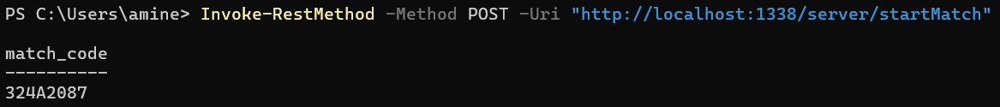
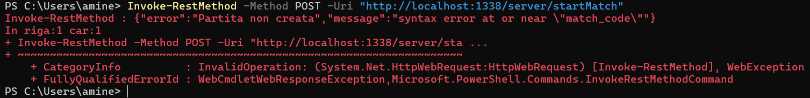
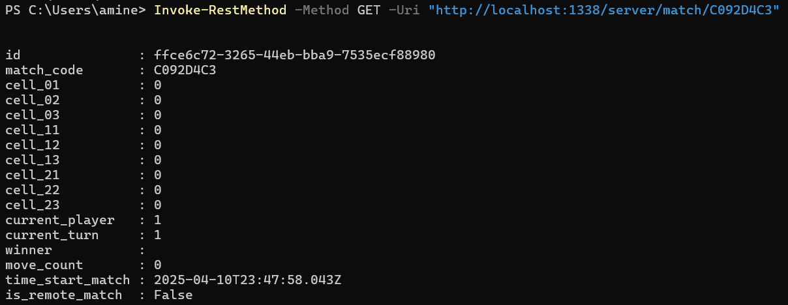
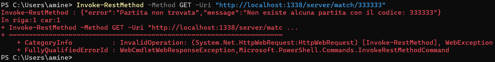
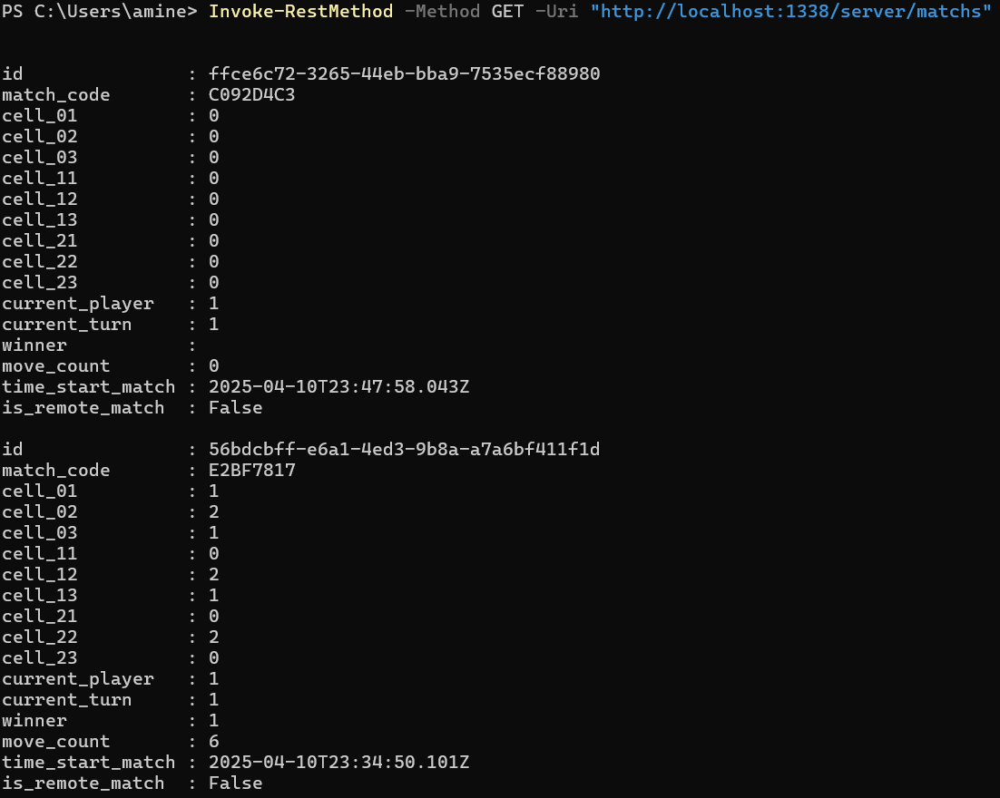
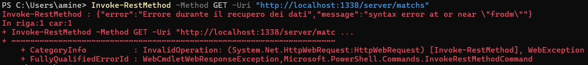
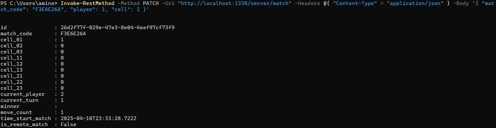
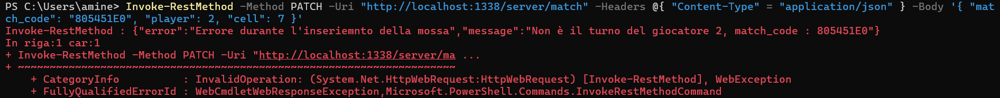
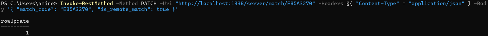

# Documentazione Backend tic tac toe

# cURL Test

## INIZIALIZZA UNA NUOVA PARTITA

### COMANDO : Invoke-RestMethod -Method POST -Uri "http://localhost:1338/server/startMatch"

TORNA IN CODICE DELLA PARTITA CREATA

gestione errori :

1 - se il server non riesce a creare la partita allora torna un codice di errore con il motivo per cui non è riuscito a crearla

{
    "error": "Partita non creata",
    "message": "syntax error at or near \"match_code\""
}

## 2 - TORNA UNA PARTITA TRAMITE IL MATCH CODE PRESENTE COME PARAMETRO NEL URL

### COMANDO : Invoke-RestMethod -Method GET -Uri "http://localhost:1338/server/match/{CODICE DEL MATCH}"

esempio : Invoke-RestMethod -Method GET -Uri "http://localhost:1338/server/match/C092D4C3"

gestione errori

1 - se viene passato un match_code che non è presente a db

## 3 - TORNA LA LISTA DELLE PARTITE

### COMANDO : Invoke-RestMethod -Method GET -Uri "http://localhost:1338/server/matchs"

gestione errori :

1 - se il server non riesce a tornare la lista delle partite allora torna il messaggio di errore accompagnato dal messaggio di errore

{
    "error": "Errore durante il recupero dei dati",
    "message": "syntax error at or near \"frodm\""
}

## 4 - INSERISCE UNA MOSSA (modifica il record match)

### COMANDO : Invoke-RestMethod -Method PATCH -Uri "http://localhost:1338/server/match" -Headers @{ "Content-Type" = "application/json" } -Body '{ "match_code": "F3E6E26A", "player": 1, "cell": 1 }'

sostitire i campi del body { "match_code": "F3E6E26A", "player": 1, "cell": 1 }

match_code : codice della partita

player : "id del giocaotre"

cell : "la cella che si vuole modificare"

TORNA = La risorsa modificata come si ppuo vedere nella cella_01 (1) è stato inserito il numero del giocatore

gestione errori :

1 errore perche viene passato un match_code nel corpo che non esiste a database

2 errore perche viene effettuata una giocatore il cui turno non è quello corretto

3 errore perche si tenta di fare una mossa su una posizione già occupata

## 5 - ABILITÀ LA PARTITA REMOTA (modifica il record match)

### COMANDO : Invoke-RestMethod -Method PATCH -Uri "http://localhost:1338/server/match/E85A3270" -Headers @{ "Content-Type" = "application/json" } -Body '{ "match_code": "{CODICE DEL MATCH }", "is_remote_match": true }'

esempio : Invoke-RestMethod -Method PATCH -Uri "http://localhost:1338/server/match/E85A3270" -Headers @{ "Content-Type" = "application/json" } -Body '{ "match_code": "E85A3270", "is_remote_match": true }'

TORNA IL NUMERO DI RIGHE MODIFICATE

## Database 

### DATABASE REALIZZATO CON POSTGRES 

per la creazione del database è presente un file dentro la cartella db--- > Backend_Tic_Tac_Toe\app\db\creationDb.sql

in questo file sono presenti query per la creazione della struttura db

una tabella ---> matchs

e due funzioni 

insert_move ---> inserisce una nuova mossa

match_code  ---> crea una nuova partita

## Configurazione .env

configurare la configurazione del database e la porta del server

esempio con dati :

//PORT WHERE APP LISTENING

PORT = 1338

//CONFIG DATABASE

DB_HOST=127.0.0.1

DB_USER=postgres

DB_PORT=5432

DB_PASSWORD=mypassword

DB_NAME=tictactoe