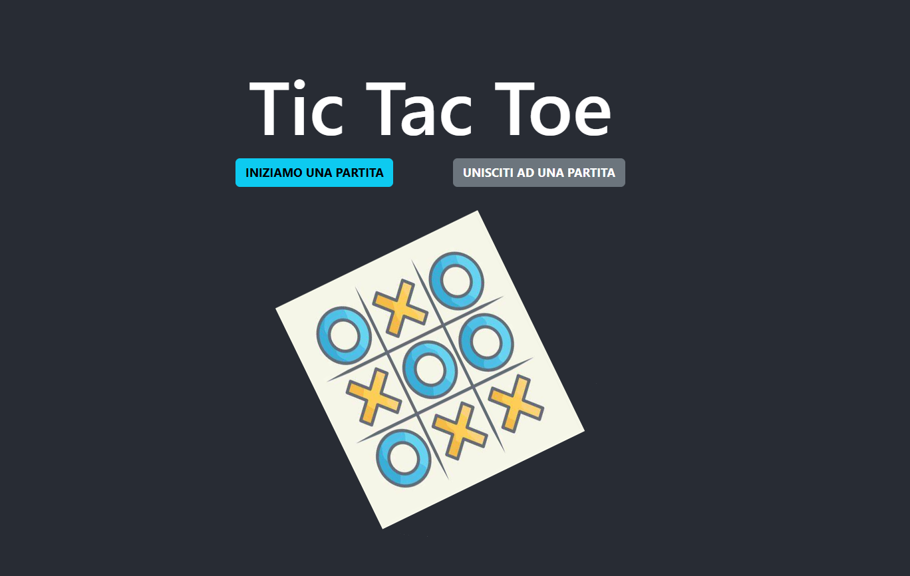
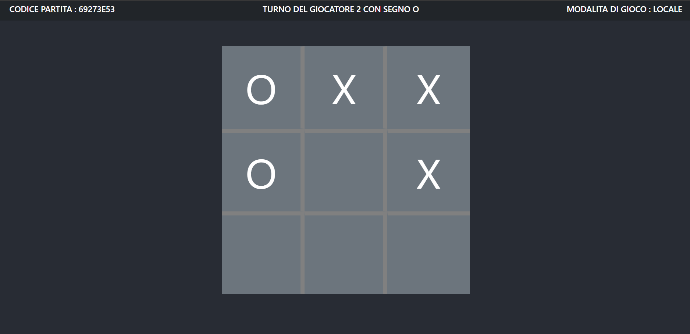
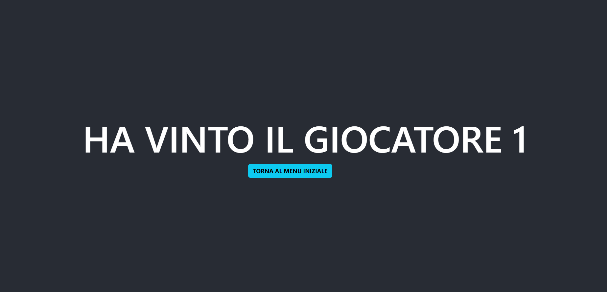
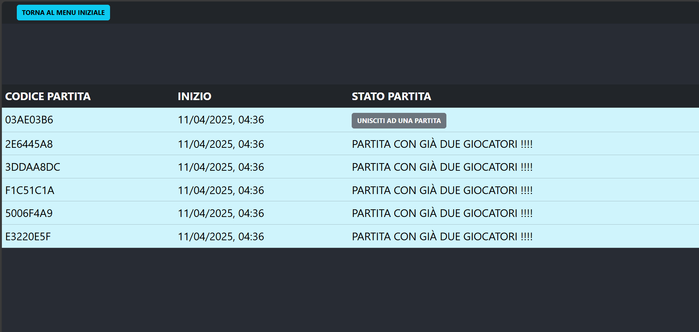
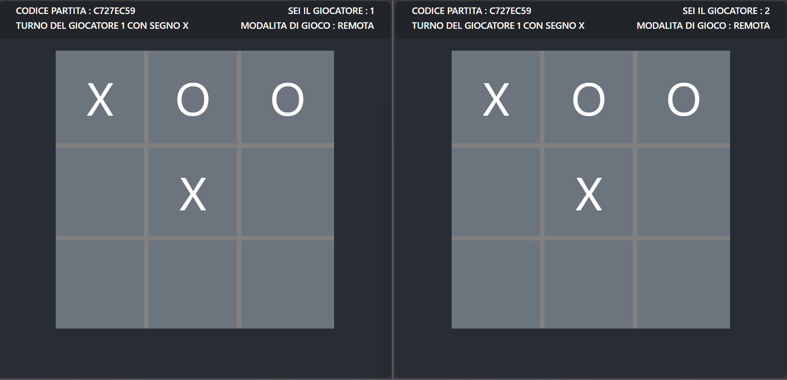
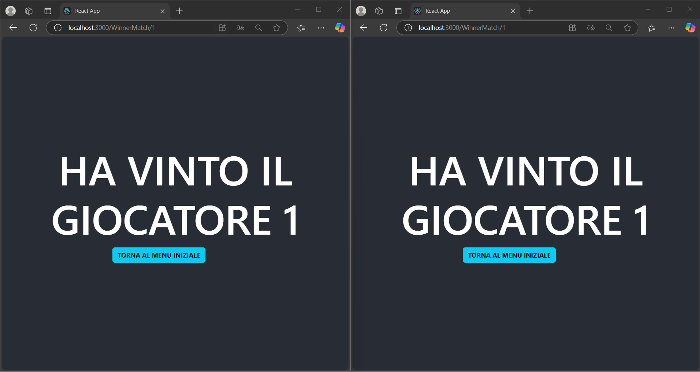

# Documentazione Frontend tic tac toe 

# FUNZIONAMENTO APP

### HOME PAGE

1 INIZIA UNA PARTITIA -->  crea e ti porta alla partita creata

2 UNISCITI AD UNA PARTITA --> ti porta alla lista delle partite

### INIZIA UNA NUOVA PARTITA

### PARTITA LOCALE

l'utente puo decidere se condividere il codice con un'altro player il codice che si trova in alto a sinsitra

oppure se sono presenti due giocatori nello steso schermo allora possono giocare subito facendo due mosse si consolida il fatto che la partita si gioca localmente

giocano fin quando non vengono finite le mosse oppure uno dei due vince 

se uno dei due vince compare il numero del gicatore che ha vinto

### PARTITA REMOTA

un utente puo farsi dare il codice della partita e cliccando il bottone verra portato alla partita ---> quest'ultimo sarà il giocatore 2

le due partite contanuano separatamente e le due interfaccie si aggiornano tramite un sistema socket ---> socket.IO

se uno dei due vince le due interfaccie vengono aggiornate con il vincitore

## Configurazione .env

configurare il socket del server

REACT_APP_API_URL=http://127.0.0.1:1338